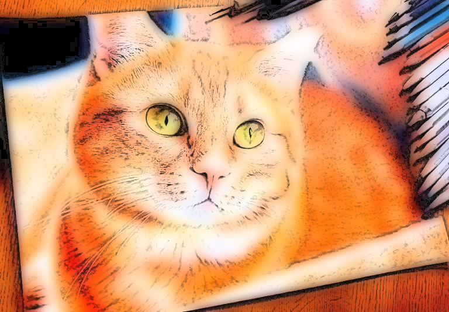
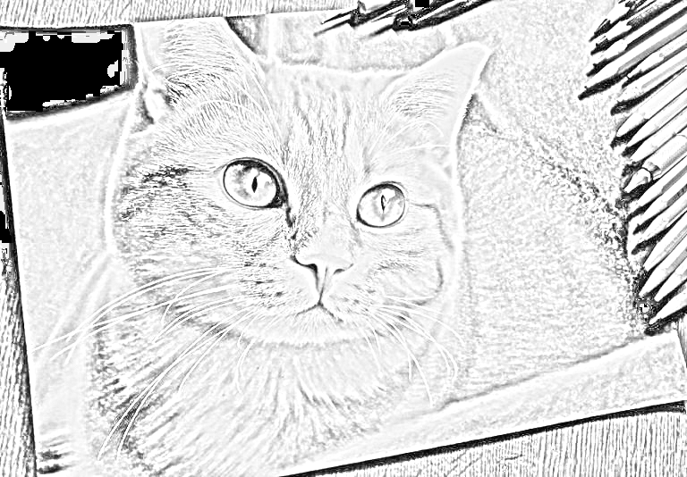

# Website Draw Photos

# Introduction
- A website to create paintings from photos.
- You can upload any image you want to turn into a watercolor or pencil painting.
- Or you may choose to reduce noise for an image.
- Or free drawing.

# Watercolor

    

# Pencil

    

# Using

- Vercel: Hosting Services
- Git & Github: Version Control
- Streamlit: create interactive web applications with simple interface.
- cv2 (OpenCV): Used for image processing, such as color conversion, filtering, and blurring.
- PIL (Pillow): Used for image processing and conversion.
- BytesIO: Used to work with binary image data in memory buffer.
- numpy: Used for array and image matrix processing.
- streamlit_drawable_canvas: A custom library for Streamlit to create a drawable canvas.

# Run
  streamlit run (Location containing the main.py file)
